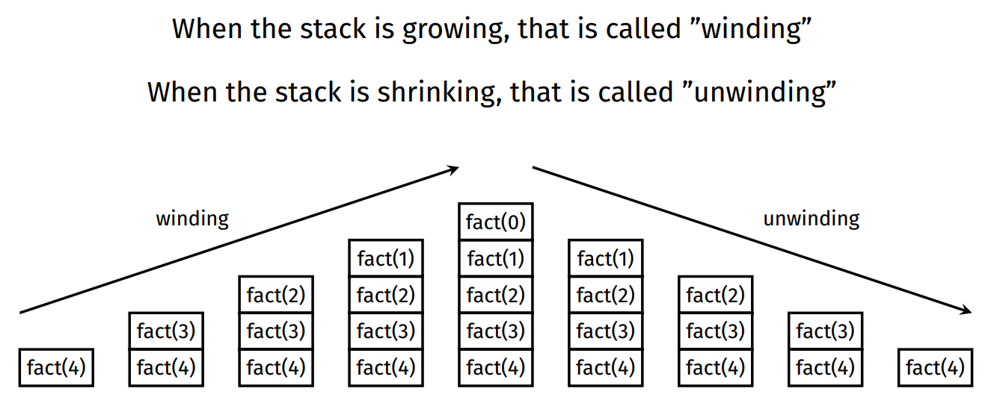
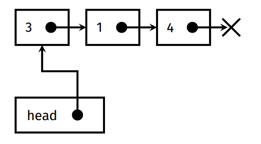
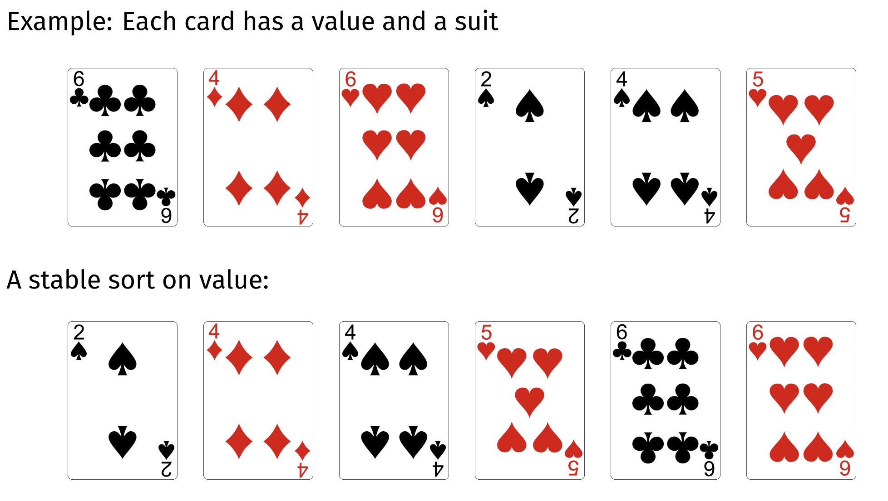

# 2521 Notes

### General Info

- **Email:** cs2521@cse.unsw.edu.au
- **Tutor**: kan.walter@unsw.edu.au
- **Lectures**: https://www.youtube.com/playlist?list=PLi2pCZz5m6GEftzPIxVH1ylwytux9WOGN
- **Lecture Slides**: https://slides.com/haydensmith/decks/comp2521-21t2
- **Algorithm Visualisation**: https://csvistool.com/

### Compiling, Sanitizers, Valgrind

```bash
clang -Wall -Werrors -g -fsanitize=address,leak,undefined
# msan incompatible with asan and lsan
clang -Wall -Werrors -g -fsanitize=memory,leak,undefined

valgrind ./compiled_program
```

https://comp2521unsw.github.io/sanitisers-guide/

### Recursion

Solving a problem recursively in a program involves writing functions that call themselves from within their own code.

**Structure**:

- Base case (stopping case): no recursion here.
- Recursive case: calls the function on a smaller version of the problem.

```c
// Factorial Example
int factorial(int n) {

	if (n == 0) {
		return 1;
	} else {
		return n * factorial(n - 1);
	}
}
```

Each time a function is called recursively, it creates a stack frame, which is created as part of the function call and removed when function returns.



A recursive solution will generally use more memory than an iterative solution.

### Wrapper Structs

Recursive solutions sometimes require recursive helper functions.

- add "do" to original function for helper function name.

```c
void listAppend(struct list *list, int value) {
	list->head = doListAppend(list->head, value);
}

struct node *doListAppend(struct node *node, int value) {
	if (node == NULL) {
		return newNode(value);
	} else {
		node->next = doListAppend(node->next, value);
	return node;
	}
}
```



### Pseudo Code

Pseudocode is a method of describing the behaviour of a program without needing to worry about the language it's written in or the machine it runs on.

### Time Command

`time` command

- real: time taken on the clock to complete
- user: time taken for the CPU to process your program
- sys: time taken by the operating system for special actions (e.g. malloc, file open & close)

### Analysis of Algorithms

- Efficiency of an algorithm can be investigated by characterising runtime **as a function of input size n.**
- Primitive operations (assigning variables, indexing array, evaluating expressions) all have **same constant runtime.**
- Sum the number of primitive operations in algorithm, then ignore constant factors and lower order variables.
- E.g. If T(n) = 100n + 500, ignoring lower-order terms and constant factors gives **n**.

### Big-O Notation

- Big-O is a notation used to describe the asymptotic relationship between functions.
  - **Formally**:
    Given functions f(n) and g(n), we say that f(n) is O(g(n)) if:  
     - There are positive constants c and n0 such that: - f(n) ≤ c · g(n) for all n ≥ n0
  - **Informally**:
    Given functions f(n) and g(n), we say that f(n) is O(g(n)) if for sufficiently
    large n, f(n) is bounded above by some multiple of g(n).
- **Note**: Don’t need to know the maths, just a definition of how it works.

### Time-Complexity

Time complexity is the amount of time taken by an algorithm to run, as a function of the input. Expressed using big-o notation.

- Constant: `1`
- Logarithmic: `log n`
- Linear: `n`
- N-Log-N: `n log n`
- Quadratic: `n^2`
- Cubic: `n^3`
- Exponential: `2^n`
- Factorial: `n!`


### Sorting

Items are sorted based on some property (called the **key**), using an ordering relation on that property.

#### Stable Sorting

A stable sort preserves the relative order of items with equal keys.  


#### Adaptive Sorting

An adaptive sorting algorithm takes advantage of existing order in its input. Time complexity of an adaptive sorting algorithm will be better for sorted or nearly-sorted inputs.

#### In-place Sorting

An in-place sorting algorithm sorts the data within the original structure, without using temporary arrays.
