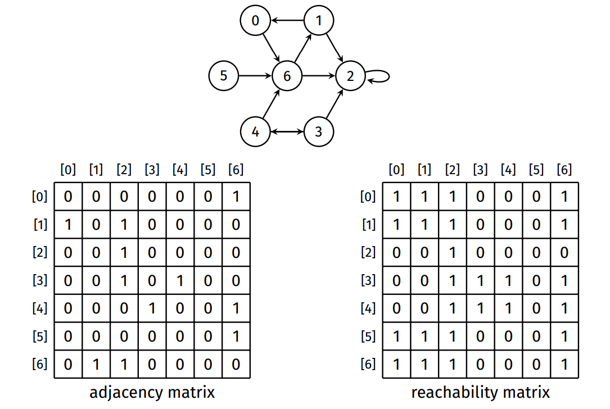

# 2521 Notes

- [General Info](2521.md#general-info)
- [Compiling, Sanitizers, Valgrind](2521.md#compiling-sanitizers-valgrind)
- [Recursion](2521.md#recursion)
- [Analysis of Algorithms](2521.md#analysis-of-algorithms)
- [Sorting](2521.md#sorting)
  - [Basic Sorts](2521.md#basics-sorts)
  - [Faster Sorts](2521.md#faster-sorts)
- [ADT](2521.md#adt-abstract-data-types)
- [Binary Search Trees](2521.md#binary-search-trees)
  - [Search](2521.md#search)
  - [Rotations](2521.md#rotations)
- [AVL Trees](2521.md#avl-trees)
- [Graphs](2521.md#graph)
  - [Representation](2521.md#graph-representation)
  - [Traversal](2521.md#graph-traversal)
  - [Algorithms](2521.md#graph-algorithms)
  - [Directed and Weighted Graphs](2521.md#directed-and-weighted-graphs)
  - [Dijkstra's Algorithm](2521.md#dijkstras-algorithm)
- [Minimum Spanning Trees](2521.md#minimum-spanning-trees)
- [Hash Tables](2521.md#hash-tables)
  - [Collisions](2521.md#collisions)
- [Priority Queues](2521.md#priority-queues)
- [Heaps](2521.md#heaps)
- [Tries](2521.md#tries)


### General Info

- `Email:` cs2521@cse.unsw.edu.au
- `Tutor`: kan.walter@unsw.edu.au
- `Lectures`: https://www.youtube.com/playlist?list=PLi2pCZz5m6GEftzPIxVH1ylwytux9WOGN
- `Lecture Slides`: https://slides.com/haydensmith/decks/comp2521-21t2
- `Algorithm Visualisation`: https://csvistool.com/, https://visualgo.net/en, https://structs.sh/

### Compiling, Sanitizers, Valgrind

```bash
clang -Wall -Werrors -g -fsanitize=address,leak,undefined
# msan incompatible with asan and lsan
clang -Wall -Werrors -g -fsanitize=memory,leak,undefined

valgrind ./compiled_program
```

https://comp2521unsw.github.io/sanitisers-guide/

## Recursion 
Solving a problem recursively in a program involves writing functions that call themselves from within their own code.

#### Structure:

- Base case (stopping case): no recursion here.
- Recursive case: calls the function on a smaller version of the problem.

```c
// Factorial Example
int factorial(int n) {

	if (n == 0) {
		return 1;
	} else {
		return n * factorial(n - 1);
	}
}
```

Each time a function is called recursively, it creates a stack frame, which is created as part of the function call and removed when function returns.


A recursive solution will generally use more memory than an iterative solution.

## Wrapper Structs

Recursive solutions sometimes require recursive helper functions.

- add "do" to original function for helper function name.

```c
void listAppend(struct list *list, int value) {
	list->head = doListAppend(list->head, value);
}

struct node *doListAppend(struct node *node, int value) {
	if (node == NULL) {
		return newNode(value);
	} else {
		node->next = doListAppend(node->next, value);
	return node;
	}
}
```


## Pseudo Code

Pseudocode is a method of describing the behaviour of a program without needing to worry about the language it's written in or the machine it runs on.

## Analysis of Algorithms
- Efficiency of an algorithm can be investigated by characterising runtime `as a function of input size n.`
- Primitive operations (assigning variables, indexing array, evaluating expressions) all have `same constant runtime.`
- Sum the number of primitive operations in algorithm, then ignore constant factors and lower order variables.
- E.g. If T(n) = 100n + 500, ignoring lower-order terms and constant factors gives `n`.

#### Time Command

`time` command

- real: time taken on the clock to complete
- user: time taken for the CPU to process your program
- sys: time taken by the operating system for special actions (e.g. malloc, file open & close)

#### Big-O Notation

- Big-O is a notation used to describe the asymptotic relationship between functions.
  - `Formally`:
    Given functions f(n) and g(n), we say that f(n) is O(g(n)) if:  
     - There are positive constants c and n0 such that: - f(n) ≤ c · g(n) for all n ≥ n0
  - `Informally`:
    Given functions f(n) and g(n), we say that f(n) is O(g(n)) if for sufficiently
    large n, f(n) is bounded above by some multiple of g(n).
- `Note`: Don’t need to know the maths, just a definition of how it works.

#### Time-Complexity

Time complexity is the amount of time taken by an algorithm to run, as a function of the input. Expressed using big-o notation.

- Constant: `1`
- Logarithmic: `log n`
- Linear: `n`
- N-Log-N: `n log n`
- Quadratic: `n^2`
- Cubic: `n^3`
- Exponential: `2^n`
- Factorial: `n!`


## Sorting
Sorting refers to arranging a collection of items in order. Items are sorted based on some property (called the `key`), using an ordering relation on that property.

#### In-place Sorting
An in-place sorting algorithm sorts the data within the original structure, without using temporary arrays.

#### Stable Sorting

A stable sort preserves the relative order of items with equal keys.  


#### Adaptive Sorting

An adaptive sorting algorithm takes advantage of existing order in its input. Time complexity of an adaptive sorting algorithm will be better for sorted or nearly-sorted inputs.

## Basics Sorts

#### Bubble Sort

Moves through the list pair-wise, swapping pairs in the wrong order. Repeats this process until list is sorted.

Properties: 
- Stable
- Adaptive
- In-place

Time Complexity: 
- Worst Case: `O(n^2)`
- Average Case: `O(n^2)`
- Best Case: `O(n)`, already sorted

```c
void bubbleSort(int a[], int lo, int hi) {
   int i, j, nswaps;
   for (i = lo; i < hi; i++) {
      nswaps = 0;
      for (j = hi; j > i; j--) {
         if (less(a[j], a[j-1])) {
            swap(a[j], a[j-1]);
            nswaps++;
         }
      }
      if (nswaps == 0) break;
   }
}
```
#### Selection Sort
Find the smallest element, swap it with first array slot. Find the second smallest element, swap it with second array slot. Etc, until traversed through entire array.

Properties: 
- Non-stable
- Non-adaptive
- In-place

Time Complexity: 
- Worst Case: `O(n^2)`
- Average Case: `O(n^2)`
- Best Case: `O(n^2)`

  
```c
void selectionSort(int a[], int lo, int hi) {
   int i, j, min;
   for (i = lo; i < hi-1; i++) {
      min = i;
      for (j = i + 1; j <= hi; j++) {
         if (less(a[j],a[min])) min = j;
      }
      swap(a[i], a[min]);
   }
}
```
#### Insertion Sort
Take first element and treat as sorted array; take next element and insert into sorted part of array so that order is preserved; repeat until whole array is sorted

Properties: 
- Stable
- Adaptive
- In-place

Time Complexity: 
- Worst Case: `O(n^2)`
- Average Case: `O(n^2)`
- Best Case: `O(n)`, already sorted

```c
void insertionSort(int a[], int lo, int hi) {
   int i, j, val;
   for (i = lo+1; i <= hi; i++) {
      val = a[i];
      for (j = i; j > lo; j--) {
         if (!less(val,a[j-1])) break;
         a[j] = a[j-1];
      }
      a[j] = val;
   }
}
```

#### Shell Sort
An array is `h`-sorted if taking every `h`-th element yields a sorted array
- An h-sorted array is made up of `n/h` interleaved sorted arrays
- Shell sort: h-sort the array for progressively smaller `h`, ending with `h = 1`

Properties: 
- Non-Stable
- Adaptive
- In-place

Time Complexity: 
- Worst Case: Depends | `O(n^2)`
- Average Case: Depends
- Best Case: Depends | `O(nlogn)`   

```c
void shellSort(Item items[], int lo, int hi) {
   int size = hi - lo + 1;
   // find appropriate h-value to start with
   int h;
   for (h = 1; h <= (size - 1) / 9; h = (3 * h) + 1);

   for (; h > 0; h /= 3) {
      for (int i = lo + h; i <= hi; i++) {
         Item item = items[i];
         int j = i;
         for (; j >= lo + h && lt(item, items[j - h]); j -= h) {
            items[j] = items[j - h];
         }
         items[j] = item;
      }
   }
}
```

## Faster Sorts
#### Merge Sort
Recursive sort, where you split the array into equal sized partitions. Recursively sort each of the partitions, then merge the two partitions into a new sorted array.

Properties: 
- Stable
- Non-Adaptive
- Not in-place

Time Complexity: 
- Worst Case: `O(nlogn)`
- Average Case: `O(nlogn)`
- Best Case: `O(nlogn)`    

```c
void mergesort(Item a[], int lo, int hi) {
   // mid point
   int mid = (lo + hi) / 2; 
   if (hi <= lo) return;
   
   mergesort(a, lo, mid);
   mergesort(a, mid+1, hi);
   merge(a, lo, mid, hi);
}

void merge(Item items[], int lo, int mid, int hi) {
   Item *tmp = malloc((hi - lo + 1) * sizeof(Item));
   int i = lo, j = mid + 1, k = 0;

   // Scan both segments, copying to `tmp'.
   while (i <= mid && j <= hi) {
      if (le(items[i], items[j])) {
         tmp[k++] = items[i++];
      } else {
         tmp[k++] = items[j++];
      }
   }

   // Copy items from unfinished segment.
   while (i <= mid) tmp[k++] = items[i++];
   while (j <= hi) tmp[k++] = items[j++];

   // Copy `tmp' back to main array.
   for (i = lo, k = 0; i <= hi; i++, k++) {
      items[i] = tmp[k];
   }
   
   free(tmp);
}
```
 
#### Quicksort 
Choose an item to be a "pivot", then rearrange (partition) the array such that:
- All elements to the left of pivot are smaller than pivot
- All elements to the right of pivot are greater than pivot

then (recursively) sort each of the partitions

Properties: 
- Unstable
- Non-  Adaptive
- In-place sorting 

Time Complexity: 
- Worst Case: `O(n^2)`
- Average Case: `O(nlogn)`
- Best Case: `O(nlogn)`    
  
Rather than choosing a static or random pivot, try to find a good "intermediate" value by the median-of-three rule. 

```c
void quicksort(Item a[], int lo, int hi) {
   if (hi <= lo) return;
   int i = partition(a, lo, hi);
   quicksort(a, lo, i-1);
   quicksort(a, i+1, hi);
}

int partition(Item a[], int lo, int hi) {
   Item v = a[lo];  // pivot
   int  i = lo+1, j = hi;
   // same as while(1) {}
   for (;;) {
      while (less(a[i],v) && i < j) i++;
      while (less(v,a[j]) && j > i) j--;
      if (i == j) break;
      swap(a,i,j);
   }
   j = less(a[i],v) ? i : i-1;
   swap(a,lo,j);
   return j;
}
```

#### Non-comparison-based Sort
 - https://cgi.cse.unsw.edu.au/~cs2521/23T3/lectures/slides/week02wed-non-comparison.pdf

## ADT (Abstract Data Types)
A `data type` is a set of values and a collection of operations on those values. eg int, array.

`Abstraction`: Hiding details of a how a system is built in favour of focusing on the high level behaviours, or inputs and outputs, of the system. eg C abstracts away assembly/MIPS code.

`ADT` is a description of a data type that focuses on it's high level behaviour, without regard for how it is implemented underneath. 

- The interface of an ADT is defined in a `.h` file like `Stack.h`
- The implementation of an ADT is defined in a `.c` file like `Stack.c`

## Binary Search Trees
A `tree` is a branched data structure consisting of a set of connected nodes. 

`Binary trees` are trees where each node can have up to two child nodes, typically called the left child and right child.

A `Binary search tree` is an ordered binary tree, where `left node < node < right node.`

```c
struct node {
   int item;
   struct node *left;
   struct node *right;
};
```
#### Structure
- `Root node` is the node with no parent node.
- `Leaf node` is a node that has no child nodes
- `Internal node` is a node that has at least one child node.
- `Height of a tree`: Maximum path length from the root node to a leaf
- A tree is `balanced` if close to minimal height, and `degenerate` if close to maximal height.


## Analysis Rudimentary Tree methods
- In each iteration it progresses down one level of the tree, the total steps will thus be the `height` of the tree
  


## Search
- Pre-order (NLR): visit root, then traverse left subtree, then traverse right subtree
- In-order (LNR): traverse left subtree, then visit root, then traverse right subtree
- Post-order (LRN): traverse left subtree, then traverse right subtree, then visit root
- Level-order: visit root, then its children, then their children, and so on
  
 
 

## Rotations
- The rotated node takes the `position` of its child

 
 
<br>
  
```c
struct node *rotateRight(struct node *root) {
   if (root == NULL || root->left == NULL) return root;
   struct node *newRoot = root->left;
   root->left = newRoot->right;
   newRoot->right = root;
   return newRoot;
}
```
- Time Complexity: O(1)

## Partition
- Find the element with index i
- Rotate until it is at root
  - If node is left of parent, rotate right
  - If node is right of parent, rotate left

 
 

## BST Balancing Methods
#### Global Rebalacning
Rebalance the entire tree by rotating the median node to the root (size / 2) to the root, then recursively rebalance the subtrees.

- Time complexity - O(n log(n))

#### Root insertion
Insert new value normally (at the leaf) and then rotate the new node up to the root.

- Time complexity - O(h)
- No guarentee that tree is balanced

#### Randomised Insertion
Randomly choose whether to insert normally (leaf) or insert at root node.

- Time complexity - O(h)
- No guarentee that tree is balanced

## AVL Trees
Insert item recursively, like normal BST, then 
- Check balance at each node along the insertion path in reverse.

    

- When there is an imbalance, solve it by `rotating` the tree left or right. 

 
   
 
 

slides: https://cgi.cse.unsw.edu.au/~cs2521/23T3/lectures/slides/week04mon-balanced-bsts.pdf

Trade Offs: 
- Balance checking at each node requires memory to store the height of each node.
- O(1) operation every insert to rebalance
- O(1) operations to adjust the height data when a `node is inserted` or when a `rotation` is performed 
- Height of current node = `max(height(left), height(right)) + 1`

`AVL Trees Properties`

- Always height-balanced
- `O(log (n))` for insertion, search and deletion
- Not necessarily size balanced.

## Graphs
A graph G is a set of vertices `V`(nodes, circles) and edges `E` (link, lines).


- Directed: If edges in a graph are directed, the graph is a directed graph or digraph. A digraph with `V` vertices can have at most `V^2` edges.
- Multi-Graphs: Allow multiple edges between two vertices (callgraphs, maps)
- Weighted Graphs: Each edge is associated with a weight. 
- Simple Graphs: A set of vertices, a set of undirected edges, no self loops, no parallel edges

#### Terminology 
A graph with `V` verticies has at most V(V-1) / 2 edges
- If number of `E` closer to `V^2`, it is `dense`  
- If number of `E` closer to `V`, it is `sparse`  

   
  
<br>

- Two vertices are `adjacent` if an edge connects them (v1 and v2)
- The `degree` of a vertex is the number of edges incident on `V` (a incident on v1 and v2)

   

<br>

- A `subgraph` is a subset of vertices and associated edges
  
   

- A `path` is a sequence of verticies and edges
- A `cycle` is a path where last vertex = start vertex 
- `Length` of a path is number of edges in it
  
   

- A `connected graph` has a path from every vertex to every other vertex
- A `complete graph` is where every `V` is conncted to all other `V's`
  
   

- `Tree`: Connected graph with no cycles
- `Spanning tree`: A subgraph of G containing all of V and it itself is a tree (connected, no cycles)
- `Spanning forest`: A subgraph of G containing all of V, and is a set of trees (not connected, no cycles), with one tree for each connected component
- `Clique`: Complete subgraph

   

## Graph Representation
`struct node `edges` means a pointer to a pointer to a `struct node`
  
#### Adjacency Matrix


- Initialisation: O(V^2)
- Time Complexity: O(1)
- Space Complexity: O(V^2)
  
#### Adjacency List


- Time Complexity: O(V)
- Space Complexity: O(V + E)

#### Adjacency Edges
Edges represented by an array of edge structs (pairs of vertices)


Note: `struct edge *edges` is a pointer to an edge array (`malloc`)

- Initialisation: O(1)
- Time Complexity: O(E)
- Space Complexity: O(E)

Other Factors
- If array is full on insert, realloc more memory  

## Graph Traversal

### Breadth-first search (BFS)
Breadth-first search visits vertices in order of distance from the starting vertex. 
- Visits the starting vertex, then the neighbours of the starting vertex, then the neighbours of those neighbours. 
- BFS is implemented iteratively using a queue.

```c
void breadthFirst(Graph g, int src) {
	bool *visited = calloc(g->nV, sizeof(bool));
	int *pred = calloc(g->nV, sizeof(int));
	Queue q = QueueNew();

	visited[src] = true;
	QueueEnqueue(q, src);
	while (!QueueIsEmpty(q)) {
		int v = QueueDequeue(q);

		printf("%d\n", v);
		for (int w = 0; w < g->nV; w++) {
			if (g->edges[v][w] && !visited[w]) {
				visited[w] = true;
				pred[w] = v;
				QueueEnqueue(q, w);
			}
		}
	}

	free(visited);
	free(pred);
	QueueFree(q);
}
```
- `Queue` to find next node to go too. 
- `Visited array` to checked if node has been visited and path.
- `Time complexity`: O(V + E)

   

### Depth-first search (DFS)
Going as deep as possible until you reach a dead end, and then unwinding back through nodes until there is another branch to take.

- DFS can be implemented recursively or iteratively.
- An iterative DFS is almost identical to an iterative BFS, except we use a `stack` instead of a `queue`.

```c
void depthFirst(Graph g, int src) {
	bool *visited = calloc(g->nV, sizeof(bool));
	int *pred = calloc(g->nV, sizeof(int));
	Stack s = StackNew();

	StackPush(s, src);
	while (!StackIsEmpty(s)) {
		int v = StackPop(s);

		if (visited[v]) continue;
		visited[v] = true;

		printf("%d\n", v);
		for (int w = g->nV - 1; w >= 0; w--) {
			if (g->edges[v][w] && !visited[w]) {
				pred[w] = v;
				StackPush(s, w);
			}
		}
	}

	free(visited);
	free(pred);
	StackFree(s);
}
```

- `Stack` to find next node to go too. 
- `Visited array` to checked if node has been visited and path.
- `Time complexity`: O(V + E)
  
## Graph Algorithms

#### Cycle checking
A graph has a cycle if, at any point in the graph:
- It has a path of length > 2,
- Where start vertex = end vertex, and without using any edge more than once

<br>

- Perform a DFS starting from any vertex and if at any point, the current vertex has an edge to an already-visited vertex, then there is a cycle.
- Looping over all possible vertex combinations.
- Time complexity: O(V + E) as it uses DFS

   

#### Connected Components
- `Subgraph`: A subset of vertices and edges of original graph
- `Connected subgraph`: There is a path between every pair of vertices in the subgraph
- `Maximally connected subgraph`: no way to include more edges/vertices from original graph into the subgraph such that subgraph is still connected

A `connected component` is a maximally connected subgraph. 3 connected components below:


To find how many connected subgraphs there are, create a `componentOf` array, where each index refers to a vertex, and the value at that index refers to which graph it's in.


For applications where connectivity is crucial, time complexity can be reduced by caching the components array in the graph struct
```c
struct graph {
...
int nC; // number of connected components
int *cc; // componentOf array (value at particular index, not the index number)
};
```

#### Hamiltonian Path and Circuit
- A `Hamiltonian path` is a path that includes each vertex exactly once
- A `Hamiltonian circuit` is a cycle that includes each vertex exactly once

   

- Brute force: Use recursive DFS to check all possible paths, as it allows for backtracking
- Keep track of the number of vertices left to visit and stop when reaches 0
- Set all verticies to no visited to check for next path

- Time complexity: O(V!)

#### Euler Path and Circuit 
- An `Euler path` is a path that includes each edge exactly once
- A `Euler circuit` is a cycle that includes each edge exactly once

   

- A graph has an `Euler path` if and only if exactly zero or two vertices have odd degree, and all vertices with non-zero degree belong to the same connected component
- A graph has an `Euler circuit` if and only if every vertex has even degree, and all vertices with non-zero degree belong to the same connected component

<br>

- Finding degree of every vertex is O(V + E)
- Checking connectivity requires a DFS which is O(V + E)
- Worst-case time complexity is O(V + E)

## Directed and weighted graphs
#### Directed Graphs 
Digraphs are very similar to normal graphs, except that edges have a sense of direction such that: v → w   ≠   w → v


- Each edge (v, w) has a source v and a destination w.
- `in-degree`: the number of directed edges leading into the vertex
- `out-degree`: the number of directed edges leading out of the vertex
- `directed path`: sequence of vertices with directed edges between
- `directed cycle`: a directed path where first and last vertex are same
- `reachability`: directed path from v to w  - (w is reachable from v)
- `strongly connected`: path from v to w and w to v 
- `strong connectivity` every vertex reachable from every other vertex

   

#### Weighted Graphs
In a weighted graph, each edge (s, t, w) has a weight w. 
- Weights can be used in both directed and undirected graphs.   


Adjacency matrix:
- store weight in each cell, not just true/false.
- need some “no edge exists” value: zero might be a valid weight.
  


Adjacency list
- add weight to each list node
  


Edge list:
- add weight to each edge
  


## Digraph Algorithms

#### Traversal
Digraph traversal is same as normal traversal using BFS or DFS. E.g. navigating wikepedia pages

#### Cycle checking
In directed graphs, a cycle is a directed path where the start vertex = end vertex


#### Transistive closure
One way to implement a reachability check (one vertex reachable from another) is to use DFS or BFS from the first vertex.



<br>

#### Warshall's Algorithm


#### Shortest Path

In a weighted graph:
   - A path is a sequence of edges and the cost of a path is the sum of edge weights along the path
   - The shortest path is the path with minimum cost

Example: For 0 -> 1, the shortest path is 0 -> 2 -> 1


## Dijkstra's algorithm 
Is used to find the shortest path in a weighted graph with non-negative weights

- `Distance array`: Shortest currently know distance to each vertex (array: numbers)
- `Pred array`: Keep track of predecessor of each vertex on current shortest path
- `Set of verticies`: Stores unexplored vertices

If a shorter path to a vertex is found, the distance array needs to be updated through `edge relaxation`


Example (Slide 14) - https://cgi.cse.unsw.edu.au/~cs2521/23T3/lectures/slides/week07mon-dijkstras-algorithm.pdf

Analysis:
   - Edge edge considered once: O(E)
   - Outer loop has V iterations: 
     - Boolean array: O(V^2)
     - Array/List of verticies: O(V^2) 
     - Priority Queue: O(E + V log(V)) 

  - Note:  `Priority Queue` is best for implementation

## Minimum Spanning Trees
- A `spanning tree` of an undirected graph `G` is a subgraph of `G` that contains all verticies of `G` and is connected with no cycles
- A `minimum spanning tree` of an undirected weighted graph `G` is a spanning tree of `G` that has the minimum total edge weight among all spanning trees of `G` 
- Application: networks, electrical grids

   

### Kruskal's Algorithm 
1. Start with an empty graph
     - With same vertices as original graph
  
2. Consider edges in increasing weight order
   - Add edge if it does not form a cycle in the MST
  
3. Repeat until V − 1 edges have been added

<br>

Critical operations:
   - Iterating over edges in weight order
   - Checking if adding an edge would form a cycle

   

Analysis:
   - Sorting edges: O(E Log(E))
   - Checking if a cyle is formed: O(V) or close to O(1) if using union-find data structure
   - Time complexity overall: `O(E * V)` or` O(E * log(V))`

### Prim's Algorithm
1. Start with an empty graph
2.  Start from any vertex, add it to the MST
3. Choose cheapest edge s–t such that:
   - s has been added to the MST, and
   - t has not been added to the MST
  
   and add this edge and the vertex t to the MST
4. Repeat previous step until V − 1 edges have been added
 - Or until all vertices have been added

<br>

Critical operations:
- Finding the cheapest edge s–t such that s has been added to the MST and t has not been added to the MST
  


Analysis:
   - Algorithm considers at most `E` edges: O(E)
   - Loop has `V` iterations
      - Finding minimum-weighted edge (Set of edges): O(E)
      - Finding minimum-weighted edge (Fibonacci Heap): O(log V)
   - Time complexity overall: O(E + V * E) = `O(V * E)` or `O(E + V log(V))`

#### Comparing Kruskal's and Prim's alogrithm

Kruskal’s algorithm:
- O(E · log V)
- uses array-based data structures
- performs better on sparse graphs
  
Prim’s algorithm:
- O(E + V · log V)
- uses complex linked data structures
- in its most efficient implementation (Fibonacci heap)
- performs better on dense graphs

## Hash Tables
- An `associative array `is an abstract data type that stores key-value pairs, where keys are unique.
- A `hash table` is a data structure that stores key-value paris, where keys are unique.
- Uses an array to store key-value pairs, and a hash function that, given a key, computes an index into the array.
- Each "space" in an associative array is called a `bucket` in hashing because it can contain multiple key pair values

Operations of hash table:      
- `Insert`: Insert or replace key-value pair
- `Lookup`: Given a key, get its associated value
- `Delete`: Given a key, delete its key-value pair
  
Performance:
- `Average Case`: O(1)
  - Assuming good hash function and appropriate resizing
- `Worse Case`: O(n)
  - If all keys hash to the same value (extremely unlikely with good hash)
  


<br>

#### Hashing
- Is the process of mapping data of arbitrary size to fixed-size values using a hash function.
  - A `hash function` maps a key to an index in the range [0, N − 1]
  - Given the `same key` = `same index`


<br>

## Collisions
- Hash collision occurs when two different keys `x` and `y` return the same value
  - A hash table must have a method for resolving collisions

## Separate chaining
- Each array slot contains a list of the items hashed to that index
- Allows multiple items in one slot


<br>

```c
struct hashTable {
   struct node `slots; // array of pointers to lists
   int numSlots;
   int numItems;
};

struct node {
   int key;
   int value;
   struct node *next;
}; 
```

Average insertion, deletion and search is O(1).

## Linear Probing

Resolve collisions by finding a new slot for the item
- Each array slot stores a single item (unlike separate chaining)
- On a hash collision, try next slot, then next, until an empty slot is found
- Insert item into empty slot


<br>

```c
struct hashTable
{
   struct slot *slots;
   int numSlots;
   int numItems;
};

struct slot
   {
   int key;
   int value;
   bool empty;
};
```

### Linear Probing Deletion

`Backshifting`  
Removes and re-insert all items between the `deleted item` and the `next empty slot`


<br>

`TombStone`  
Replaces the deleted item with a “deleted” marker (AKA a tombstone) that:
- Is treated as empty during insertion


- Is treated as occupied during search/lookup


#### Comparison between backshifting and tombstone

Backshift method:
- Moves items closer to their hash index
- Thus reducing the length of their probe path
- Deletion becomes more expensive
  
Tombstone method:
- Fast
- But does not reduce probe path length
- Large number of deletions will cause tombstones to build up

#### Clustering (Linear Probe)

Items tend to cluster together into long runs, making insertions travel to end of the run and  lookups of non-existent keys must travel to the end of a run.


## Double Hashing
Double hashing improves on linear probing:
- By using an increment which is based on a secondary hash of the key, which ensures that all slots will be visited 
- Tends to reduce clustering ⇒ shorter probe paths

 

#### Double Hashing Deletion
- `Backshift` method is harder to implement due to large increments
- `Tombstone` method (lazy deletion) still works

## Collision Resolution Summary
- Seperate chainging, easy to implement, allows α > 1
- Linear probing: Fast if α << 1, complex deletion
- Double hashing: Avoids clustering issues with linear probing

- Time Complexity of all O(1) on average

## Applications of Hash tables
`Set ADT`
A set is an unordered collection of distinct elements

 

 Using a hash table allows you to insert, lookup and delete much faster than other data structures 


#### Count ADT 
A counter is a collection of items where each distinct item has a count, can you a hash table to store the count as the value.

## Priority Queues
A priority queue is an abstract data type where each item has an associated priority.

- insert
  - insert an item with an associated priority
- delete
  - delete (and return) the item with the highest priority
- peek
  - get the item with the highest priority, without deleting it
- is empty
  - check if the priority queue is empty

Priority is often given by an `integer value`.

`Implementations`


## Heaps
A heap is a `tree-based data structure` which satisfies the heap property.
The heap property specifies how values in the heap should be ordered, and depends on the kind of heap:

- In a `max heap`, the value in each node must be greater than or equal to the values in its children.
- In a `min heap`, the value in each node must be less than or equal to the values in its children.


## Binary Heap
A binary heap is a heap that takes the form of a binary tree, and satisfies the following properties:

- `Heap property` - values in the heap should be ordered (above)
- `Completeness property` -  all levels of the tree (except possibly the last) must be fully filled and the last level must be filled from left to right


<br>

Heaps are usually implemented with an `array`


### Insertion
1.  Add new item at next available position on bottom level
     - New item may violate the heap property

2. Fix up: While new item is greater than its parent (and not at the root),
swap with its parent
     - This re-organises items along the path to the root and restores the heap
property


#### Analysis

Cost of insertion:
- Add new item after last item ⇒ O(1)
- Fix up considers one item on each level in the worst case
- Heap is a complete tree ⇒ O(log n) levels
- Therefore, worst-case time complexity is O(log n)

### Deletion
1. Replace root item with last item
   - Last item = bottom-most, rightmost item
   - Let this item be i
2.  Remove last item
3.  Fix down: While i is less than its greater child, swap it with its greater
child
    - This restores the heap property


#### Analysis

Cost of deletion:
- Replace root by item at end of array ⇒ O(1)
- Fix down considers two items on each level in the worst case
- Heap is a complete tree ⇒ O(log n) levels
- Therefore, worst-case time complexity is O(log n)

## Priority Queue ADT Summary


## Tries
https://cgi.cse.unsw.edu.au/~cs2521/23T3/lectures/slides/week09wed-tries.pdf

A trie is a tree data structure:
- used to represent a set of strings
  - e.g. all the distinct words in a document, a dictionary, etc.
  - we will call these strings keys or words
- supports string matching queries in O(m) time
  - where m is the length of the string being searched for


- Each link is a individual character
- A key (word) is represented by a path in the trie
- Nodes can be tagged as 'finishing', end of a key (word)

 Analysis of standard trie:
- O(m) insertion, search and deletion
  - where m is the length of the given key
  - each of these needs to examine at most m nodes
- O(nR) space
  - where n is the total number of characters in all keys
  - where R is the size of the underlying alphabet (e.g., 26)
  
## Exam Resources
- https://gist.github.com/jedavidson/1a99b8944897d532271fe164d4ce3049
- https://webcms3.cse.unsw.edu.au/COMP2521/23T3/resources/90532
- https://learn.csesoc.org.au/course-revision/2521-23T3